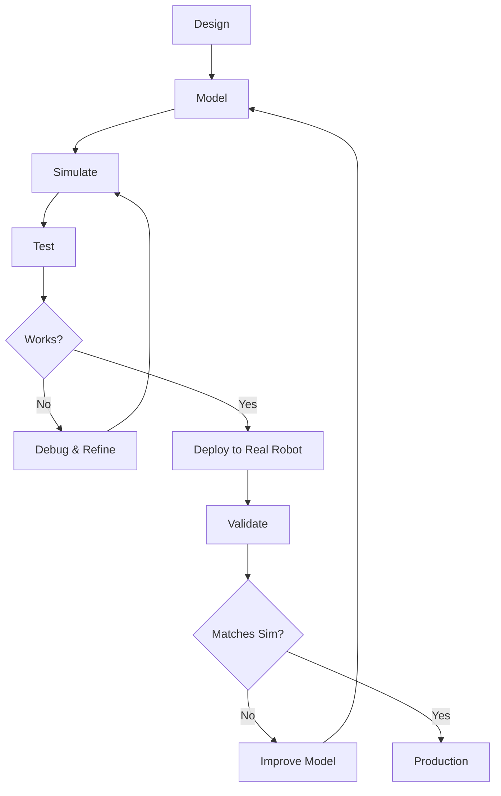

# Digital Twins

A digital twin is a virtual replica of a physical system that mirrors its behavior, properties, and dynamics. In robotics, digital twins revolutionize how we design, test, and deploy robots.

## 🎯 Learning Outcomes

By the end of this section, you will be able to:

1. **Define** digital twins and their components
2. **Explain** the benefits of digital twins in robotics
3. **Identify** different fidelity levels and when to use each
4. **Understand** the digital twin development lifecycle
5. **Compare** simulation vs real-world testing trade-offs

## 📋 Prerequisites

- Understanding of sensors and actuators (Chapter 2)
- Basic 3D geometry concepts
- Familiarity with physics (forces, motion, collisions)

---

## 🤖 What is a Digital Twin?

:::note Definition
A **digital twin** is a virtual model of a physical system that:
- Replicates the system's appearance and structure
- Simulates its behavior under various conditions
- Updates based on real-world data (in advanced implementations)
- Enables testing and prediction without physical hardware
:::

### Components of a Robot Digital Twin

A complete robot digital twin includes:

1. **3D Geometry**: Visual model of robot structure
2. **Physics Properties**: Mass, inertia, friction coefficients
3. **Joint Mechanics**: Degrees of freedom, limits, damping
4. **Actuator Models**: Motor dynamics, torque curves
5. **Sensor Models**: Camera rendering, LIDAR rays, IMU simulation
6. **Control Interface**: Same API as real robot
7. **Environment**: World model for interaction

```python
# Conceptual structure of a digital twin
class RobotDigitalTwin:
    def __init__(self):
        # Geometry and appearance
        self.geometry = load_3d_model("humanoid.urdf")
        
        # Physical properties
        self.mass_distribution = calculate_masses()
        self.inertia_tensors = calculate_inertias()
        
        # Actuators
        self.motors = [MotorModel(specs) for specs in motor_specs]
        
        # Sensors
        self.cameras = [CameraModel() for _ in range(2)]
        self.imu = IMUModel()
        self.force_sensors = [ForceSensorModel() for _ in range(4)]
        
        # Physics engine
        self.physics = PhysicsEngine()
    
    def step(self, dt):
        """Advance simulation by dt seconds."""
        # Apply motor commands
        # Simulate physics
        # Update sensor readings
        pass
    
    def get_sensor_data(self):
        """Get current sensor readings (same API as real robot)."""
        return {
            'cameras': [cam.get_image() for cam in self.cameras],
            'imu': self.imu.get_data(),
            'forces': [fs.get_reading() for fs in self.force_sensors]
        }
```

---

## 💎 Fidelity Levels

Digital twins can be built at different fidelity levels depending on your needs:

### Level 1: Kinematic Only

**What it includes**: Geometry and joint positions  
**No physics**: No gravity, collisions, or dynamics  
**Use cases**: Visualization, motion planning in free space

```python
# Kinematic-only simulation
robot = KinematicRobot("humanoid.urdf")

# Set joint angles directly
robot.set_joint_angles({
    'shoulder_pitch': 45,
    'elbow': 90,
    'wrist': 0
})

# Compute end-effector position (forward kinematics)
hand_position = robot.get_end_effector_pose('right_hand')
print(f"Hand at: {hand_position}")

# No forces, no contact, just geometry
```

**Pros**: Fast, simple, deterministic  
**Cons**: Unrealistic for dynamic tasks

---

### Level 2: Dynamic Simulation

**What it includes**: Full rigid-body physics  
**Physics**: Gravity, collisions, friction, forces  
**Use cases**: Controller testing, balance, manipulation

```python
import pybullet as p

# Dynamic simulation
p.connect(p.GUI)
p.setGravity(0, 0, -9.8)

# Load robot
robot_id = p.loadURDF("humanoid.urdf", [0, 0, 1])

# Set motor commands (not direct joint positions)
p.setJointMotorControl2(
    robot_id, 
    jointIndex=0,
    controlMode=p.POSITION_CONTROL,
    targetPosition=1.57,  # 90 degrees
    force=50  # Maximum torque
)

# Step physics - robot responds to forces
for _ in range(1000):
    p.stepSimulation()
    time.sleep(1./240.)  # Real-time
```

**Pros**: Realistic physics, tests control robustness  
**Cons**: Slower, requires tuning physics parameters

---

### Level 3: Visual Fidelity

**What it includes**: Photorealistic rendering  
**Features**: Accurate lighting, shadows, materials  
**Use cases**: Computer vision, camera-based control, training neural networks

```python
# High-fidelity visual simulation (Isaac Sim example)
from omni.isaac.kit import SimulationApp
simulation_app = SimulationApp({"headless": False})

from omni.isaac.core import World
from omni.isaac.core.utils.render import RenderProductPaths

world = World()

# Add photorealistic robot
world.scene.add_default_ground_plane()
robot = world.scene.add(Robot(prim_path="/World/Robot"))

# Set up high-quality camera
camera = Camera(
    prim_path="/World/Camera",
    resolution=(1920, 1080),
    focal_length=24.0
)

# Render with ray tracing
world.render()
image = camera.get_rgba()
```

**Pros**: Train vision algorithms, realistic appearance  
**Cons**: Computationally expensive, requires GPU

---

### Level 4: High-Fidelity Physics

**What it includes**: Deformable bodies, fluids, accurate friction  
**Features**: Soft materials, cable dynamics, detailed contacts  
**Use cases**: Soft robotics, manipulation of deformable objects

**Pros**: Most realistic simulation possible  
**Cons**: Very slow, complex setup, research-level tools

---

## 📊 Digital Twin vs Reality

### Simulation Advantages ✅

| Aspect | Benefit |
|--------|---------|
| **Cost** | No hardware needed; run 1000s of robots in parallel |
| **Speed** | Fast-forward time; test months of operation in hours |
| **Safety** | No damage from crashes or mistakes |
| **Reproducibility** | Exact same conditions every test |
| **Debugging** | Pause, inspect state, rewind time |
| **Rapid iteration** | Instant code updates, no deployment |
| **Edge cases** | Test rare/dangerous scenarios easily |

### Reality Advantages ✅

| Aspect | Benefit |
|--------|---------|
| **Accuracy** | True physics, no modeling errors |
| **Completeness** | All real-world effects included |
| **Validation** | Proves system works in practice |
| **Unexpected interactions** | Discovers unforeseen issues |

### The Reality Gap ⚠️

The **reality gap** is the difference between simulation and the real world:

```python
# Simulation: Perfect world
friction = 0.5  # Exact value
motor_response = 0.001  # 1ms delay
sensor_noise = 0  # No noise

# Reality: Messy world
friction = 0.3 to 0.7  # Varies by surface, wear, temperature
motor_response = 0.001 to 0.010  # Varies by load, temperature
sensor_noise = significant  # Multiple sources
```

:::warning Reality Gap Challenges
- **Simplified physics**: Contact dynamics are approximated
- **Perfect sensors**: No noise, dropouts, or calibration errors
- **Ideal actuators**: No backlash, friction, or thermal effects
- **Known environment**: Perfect models, no surprises
:::

---

## 🔄 Digital Twin Development Cycle



### Phase 1: Design
- Define robot structure and capabilities
- Choose actuators and sensors
- Create CAD models

### Phase 2: Model
- Convert CAD to simulation format (URDF, MJCF, USD)
- Add physics properties (mass, inertia)
- Model sensors and actuators

### Phase 3: Simulate
- Test in various scenarios
- Validate controller performance
- Optimize parameters

### Phase 4: Deploy
- Transfer controller to real robot
- Apply domain randomization techniques
- Gradual validation

### Phase 5: Validate & Iterate
- Compare sim vs real performance
- Update model based on real data
- Continuous improvement

---

## 💡 When to Use Digital Twins

### ✅ Use Digital Twins For:

- **Early development**: Test ideas before building hardware
- **Algorithm development**: Iterate quickly on control code
- **Dangerous scenarios**: Test failure cases safely
- **Batch testing**: Run many parameter combinations
- **Training neural networks**: Generate unlimited labeled data
- **Demonstration**: Show concepts without physical robot

### ❌ Don't Rely Only on Simulation For:

- **Final validation**: Always test on real hardware
- **Safety-critical systems**: Sim can't catch everything
- **Complex contact**: Grasping, manipulation need real tests
- **Long-term reliability**: Wear, degradation not simulated
- **Human interaction**: Difficult to model human behavior

:::tip Best Practice
Use digital twins for **development and iteration**, but always **validate on real hardware** before deployment.
:::

---

## 📈 Example: Development Time Comparison

**Without Digital Twin**:
```
Design → Build → Test → Fail → Redesign → Rebuild → Retest
  1 week   2 weeks  1 day   ---    1 week    2 weeks   1 day
Total: ~6 weeks per iteration
```

**With Digital Twin**:
```
Design → Model → Sim Test → Iterate (×10) → Build → Test → Success
  1 week  3 days    1 hour     2 weeks      2 weeks  1 day    ✓
Total: ~6 weeks, but most issues found early
```

**Savings**:
- Fewer physical prototypes needed
- Issues found before building hardware
- More iterations in same timeframe
- Higher confidence in final design

---

## 🎓 Case Studies

### Tesla Autopilot
- Simulates billions of miles of driving
- Tests edge cases that rarely occur in reality
- Neural networks trained primarily in simulation

### Boston Dynamics Robots
- Extensive simulation for control development
- Real hardware for validation and refinement
- Iterative sim-to-real process

### NASA Mars Rovers
- Complete digital twins for mission planning
- Test operations before commanding real rover
- Validate recovery procedures safely

---

## ✅ Key Takeaways

1. **Digital twins** are virtual replicas that simulate robot behavior
2. **Fidelity levels** range from kinematic to high-fidelity physics
3. **Simulation advantages**: cost, speed, safety, reproducibility
4. **Reality gap**: differences between sim and real must be addressed
5. **Development cycle**: iterate in sim, validate on hardware
6. **Best practice**: use simulation extensively, but always validate in reality

---

## 🧪 Practice Exercise

:::note Exercise: Digital Twin Comparison
**Difficulty**: Easy  
**Time**: 30 minutes  
**Goal**: Compare different simulation fidelity levels

**Tasks**:
1. Load the same robot in kinematic-only mode
2. Load it in dynamic simulation
3. Command the same motion to both
4. Observe and document differences
5. Measure computation time for each

**Questions to answer**:
- How do the motions differ?
- Which is faster to compute?
- When would you use each?
:::

---

## 📚 Further Reading

- ["What is a Digital Twin?"](https://www.ibm.com/topics/what-is-a-digital-twin) - IBM Overview
- "Robot Modeling and Control" by Spong et al. - Chapter on simulation
- ["Sim-to-Real Transfer in Robotics"](https://arxiv.org/abs/1812.07252) - Survey paper
- [Digital Twin Consortium](https://www.digitaltwinconsortium.org/) - Industry standards

---

**[← Previous: Chapter Introduction](./intro.md)** | **[Next: Simulation Platforms →](./simulation-platforms.md)**
