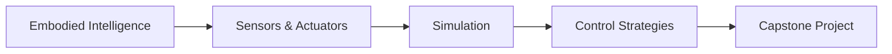

# Physical AI & Humanoid Robotics

Welcome to **Physical AI & Humanoid Robotics** - your comprehensive guide to building intelligent systems that interact with the physical world.

## 🎯 What You'll Learn

This book bridges the gap between **digital intelligence** and **physical embodiment**, teaching you how to apply AI to control humanoid robots. You'll learn:

- 🧠 **Embodied Intelligence**: How AI systems perceive and act in the physical world
- 🔌 **Sensors & Actuators**: The "nervous system" that connects robots to reality
- 🎮 **Simulation**: Building and testing digital twins before real-world deployment
- ⚙️ **Control Strategies**: From classical PID to modern learned controllers
- 🚀 **Capstone Project**: Integrate everything into a complete robotic system

## 👥 Who This Book Is For

This book is designed for **students and practitioners** who want to apply AI to control humanoid robots. You should have:

- Basic programming knowledge (Python preferred)
- Fundamental understanding of AI/ML concepts
- Curiosity about robotics and physical systems
- Access to simulation tools (no physical robot required!)

## 🗺️ Learning Path

### Chapter 1: Introduction to Embodied Intelligence
Understand what makes Physical AI different from traditional software-only AI. Learn the fundamental concepts of embodied intelligence and the sense-think-act loop.

**[Start Chapter 1 →](./01-embodied-intelligence/intro.md)**

### Chapter 2: Sensors and Actuators
Explore the "nervous system" of robots - how they perceive the world through sensors and interact through actuators.

**[Start Chapter 2 →](./02-sensors-actuators/intro.md)**

### Chapter 3: Simulating Humanoid Robots
Learn to build digital twins and test robot behaviors safely in simulation before deploying to real hardware.

**[Start Chapter 3 →](./03-simulation/intro.md)**

### Chapter 4: Real-World Control Strategies
Master the algorithms and architectures that enable robots to operate in the unpredictable real world.

**[Start Chapter 4 →](./04-control-strategies/intro.md)**

### Chapter 5: Capstone Project
Put it all together in a comprehensive project that demonstrates your mastery of Physical AI concepts.

**[Start Chapter 5 →](./05-capstone/intro.md)**

## 💡 How to Use This Book

:::tip Progressive Learning
This book is designed to be read sequentially. Each chapter builds on concepts from previous chapters. If you're new to Physical AI, start with Chapter 1.
:::

:::note Hands-On Approach
Every chapter includes practical examples and exercises. Set aside time to experiment with the code and concepts - learning by doing is essential in robotics!
:::

:::warning Prerequisites
While no physical robot is required, you'll need:
- Python 3.8+ installed
- Access to a simulation environment (installation guides provided)
- Basic understanding of coordinate systems and linear algebra
:::

## 🛠️ Tools & Technologies

Throughout this book, you'll work with:

- **Python**: Primary programming language
- **Simulation Platforms**: PyBullet, Gazebo, or Isaac Sim
- **Control Libraries**: Standard robotics control frameworks
- **AI/ML Tools**: For learned control strategies

## 📚 Additional Resources

- [Why Physical AI Matters](../Why%20Physical%20AI%20Matters.md) - Context for this field
- [Learning Outcomes](../learning%20outcomes.md) - Detailed learning objectives
- [Module Overview](../intro.md) - Platform introduction

## 🚀 Ready to Begin?

Start your journey into Physical AI by understanding what embodied intelligence means and why it's revolutionizing robotics.

**[Begin with Chapter 1: Embodied Intelligence →](./01-embodied-intelligence/intro.md)**

---

*This book is part of the Physical AI Education Platform. All content is designed to be practical, hands-on, and aligned with industry best practices.*
